# Introduction to Xilinx Vivado
## Table of Contents
- [Overview](#overview)
- [Start the application](#start-the-application)
- [Creating a project](#creating-a-project)
- [Creating the circuit](#creating-the-circuit)
- [Simulation and Verification](#simulation-and-verification)
- [Appendix](#appendix)
   * [What is Verification](#what-is-verification)
      + [Verification is Hard](#verification-is-hard)
      + [Verification is Necessary](#verification-is-necessary)
      + [Verification is Not Validation](#verification-is-not-validation)
      + [How To Do Verifiction](#how-to-do-verifiction)


## Overview
The goal of this lab is to introduce you to Vivado, an industry standard tool for design and simulation of digital logic.  
You will also be using this in ECE 385.

## Start the application
We assume you are on EWS, but this lab can also be done on your personal computer as long as you have `Vivado 2023.1`[^1] installed.

- Open the terminal on EWS
- Load the Vivado module via `module load xilinx/2023.1`
- Launch Vivado via `vivado`
- You should see the application open up as follows:  

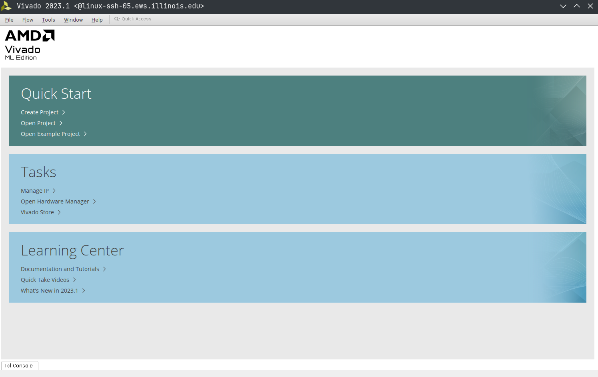

## Creating a project
- For the sake of organization, you should have a directory that houses the project we'll be doing. Unlike labs 1 and 2, you will not submit your work by pushing to git. Instead, you will be uploading a PDF of your work (more on that later). Therefore, make sure to do all of your work outside your `ece120` directory for this lab as well as labs 5 and 7. As an example, you could create a directory called `hardware_labs` under the directory named after your NetID.
- Create a project by clicking File -> Project -> New
- For the tutorial, we are going to name our project `getting_started`. Your screen should look similar to the image below,
but make sure to replace `YOUR_NETID_HERE` with your NetID. <b> IMPORTANT NOTE: For all Vivado labs, any path you select MUST NEVER include directories/files with spaces in their names! </b>
- Hit Next

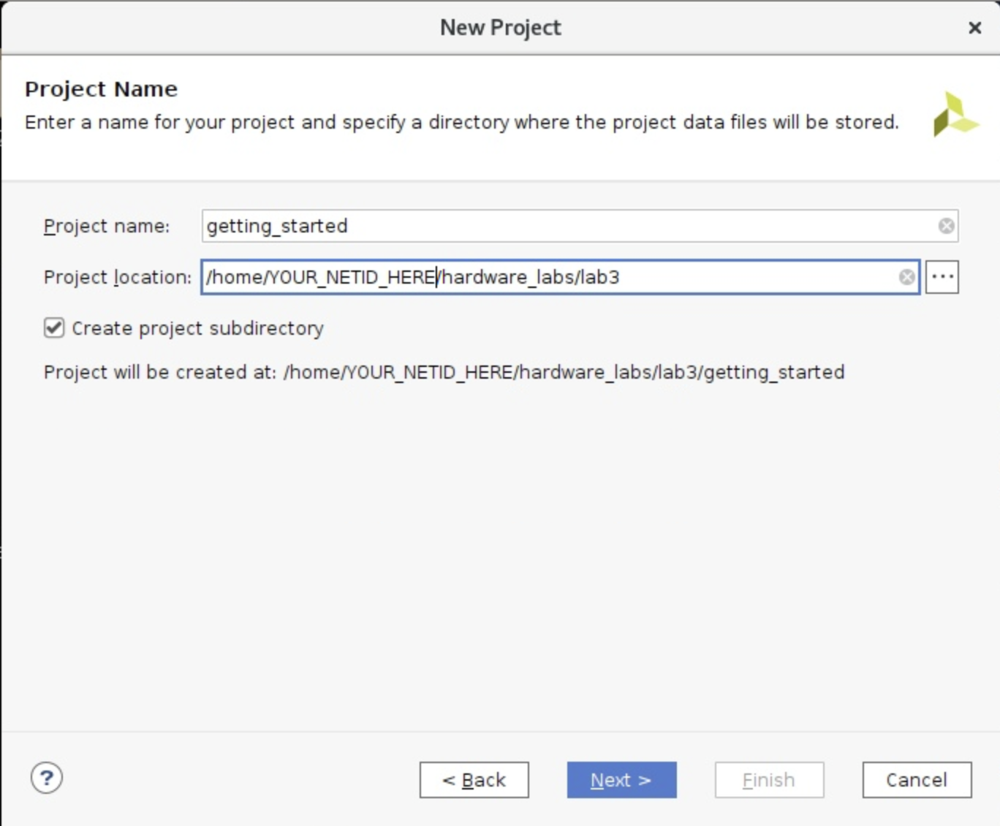

- Make sure `RTL Project` is selected as the Project Type and hit Next
- Hit Next two more times, skipping source and constraint addition
- For Default Part, select `Artix-7 AC701 Evaluation Platform` under `Boards`[^2]
- Hit Next. If you selected the correct board, it should display its name as the default board
- Finally, finish up and you should be greeted with the following page:  

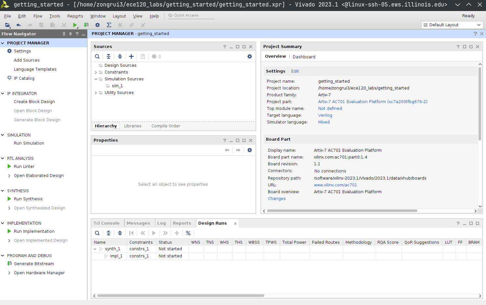

## Creating the circuit
- For the tutorial, we are going to create an `XOR` gate out of `AND`, `OR`, and `NOT` gates
- We have provided you with a repository of IPs (Intellectual Properties), that contains all the components you will need for building any circuit in ECE 120.
- At the top right, hit `Tools` -> `Settings...`
- Hit the arrow to the left of `IP`. That should reveal two new options: `Repository` and `Packager`. Hit `Repository`
- Hit the `+` button and look for the `ip` directory which should be in your ECE 120 repository. The path you end up selecting should look similar to the following path: `/home/YOUR_NETID_HERE/ece120/ip`. Again, make sure to replace `YOUR_NETID_HERE` with your NetID
- If you were able to successfully add the IP repository, you will be presented with a window similar to the one in the image below, which says that 17 IPs were detected

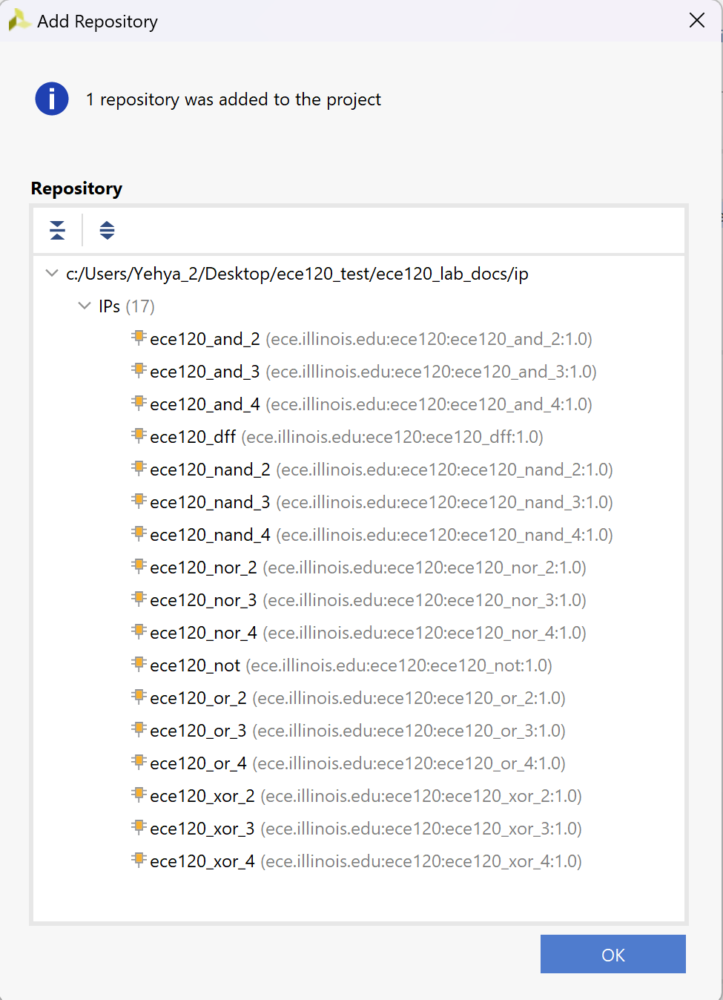

- Now hit `OK` -> `Apply` -> `OK`
- On the left hand side, under `IP INTEGRATOR`, click on `Create Block Design`, set the `Design name` to `xor_tutorial` then hit `OK`
- We can add gates by pressing the `+` button on the `Diagram` toolbar (or hit `Ctrl+I`) and type `ece120` in the search bar
- You should be presented with a list of gates corresponding to the above image. This is a list of all the components we provided you. Each logic gate's name starts with `ece120_` followed by the type of the gate and its number of inputs. For example, the gate `ece120_and_2` is a 2-input `AND` gate! 
- <b> IMPORTANT: For all assignments in ECE 120, use only the IPs we have provided you! </b>
- Go ahead and add a 2-input `AND` gate by simply clicking on `ece120_and_2`

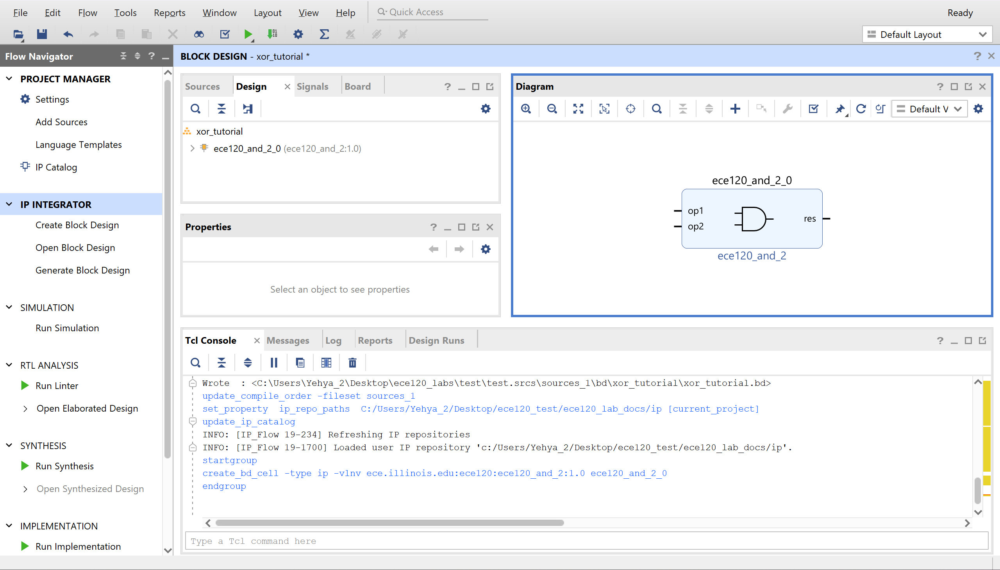

- Hint: At this point, you will probably want to make your working area larger. Hit the Maximize or the Float button at the top right of the Diagram window
- Now add one more 2-input `AND` gate, one 2-input `OR` gate, and one `NOT` gate 
- You may have noticed that one of the possible gates is an `XOR` gate. For the sake of the tutorial, please ignore that for the time being. However, you are allowed to use it as part of the assignment for this lab and upcoming labs.
- Your screen should look similar to the following image:

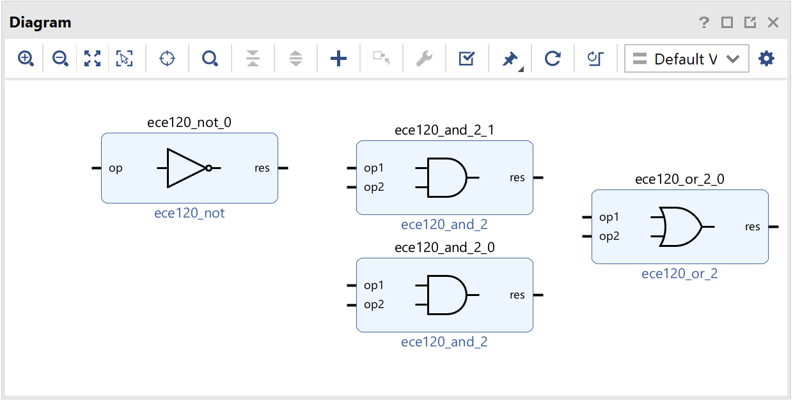

- Create ports a.k.a top-level I/O (Input/Output) by right-clicking on an empty space in the diagram and select `Create Port...`
- Hint: `Ctrl+K` also works for the previous step.
- We are going to create two input ports and one output port. Change the Port Name and Direction options to match the following table:

| Port Name | Direction |
|-----------|-----------|
| a         | input     |
| b         | input     |
| c         | output    |

- Arrange the port as follows:  

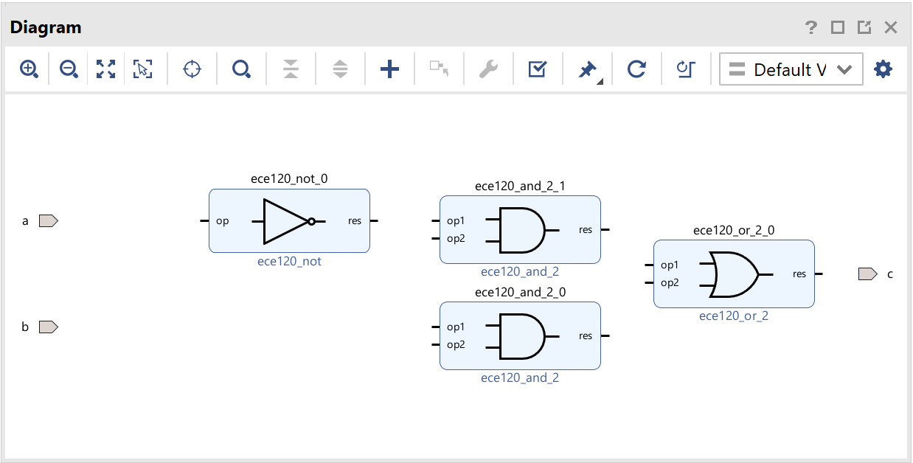

- Connect the I/O of the gates by dragging the black end of one to another such that they look like the image below. It is fine if your circuit doesn't match the below image perfectly; what matters is the connections.  

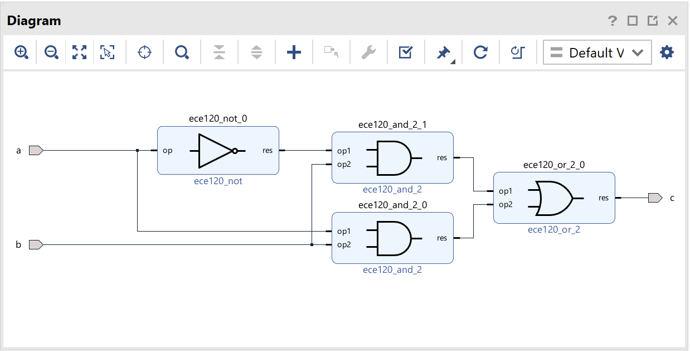

## Simulation and Verification
Congratulations! You now have what you think is a `XOR` gate. But is it actually a `XOR` gate? We can't really be sure of that until we test it.
This step is called [Verification](#what-is-verification). *Though not required for this course, I highly recommend you to follow the link and read about verification.*

- At this point, if you maximized your diagram earlier, make sure to return to the original window before following the next steps
- Start with generating a HDL (Hardware Description Language) wrapper for our block design by clicking `Generate Block Design` on the left and hitting Generate.
- Once this is done, you'll notice there is `.v` file under `Sources->Design Sources-> xor_tutorial`
- Writing testbenches is out of this course's scope, so we have provided one for you [here](./tb/xor_top_tb.sv)
- Though not required for this course, it is recommended to skim through the testbench to get an idea of what is done. You will learn all about SystemVerilog and writing testbenches in ECE 385.
- Add the testbench by pressing the `+` button under `Sources` and select `simulation sources`
- Click on `Add Files` and look for the above testbench file under `ece120/lab3/tb`. The testbench for the tutorial is called `xor_top_tb.sv`
- You should leave the module definition as is
- Run the simulation via `SIMULATION->Run Simulation->Run Behavioral Simulation`
- Once the simulation is done, you will be able to see a small tab called `Untitled 1` on the right. Click it then hit the Float button and maximize for optimal view of the waveform.
- Once you made the window large enough, hit the `Zoom Fit` button which can be found at the top of the waveform.
- Vivado will show you a simulation waveform as follows:  

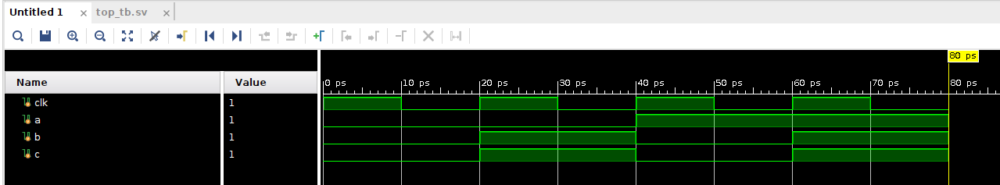

- If we look at the waveform and compare against the expected output of a XOR, we'll notice that it is incorrect
   * Some of you may have noticed already when we constructed our circuit that it is incorrect, but that's going to be harder with much more complex circuits
   * The testbench also reports the error below in `Tcl Console`

```
Error: 60: Incorrect output detected, should be 1, but is 0
Time: 60 ps  Iteration: 0  Process: /xor_top_tb/Initial13_2  Scope: xor_top_tb.Block14_3.Block15_4  File: /home/zongrui3/ece120_labs/getting_started/getting_started.srcs/sim_1/new/top_tb.sv Line: 22
Error: 80: Incorrect output detected, should be 0, but is 1
Time: 80 ps  Iteration: 0  Process: /xor_top_tb/Initial13_2  Scope: xor_top_tb.Block14_3.Block15_4  File: /home/zongrui3/ece120_labs/getting_started/getting_started.srcs/sim_1/new/top_tb.sv Line: 22
```

- Let's go back by hitting `Open Block Design` under `IP INTEGRATOR` and correct our circuit as follows:  

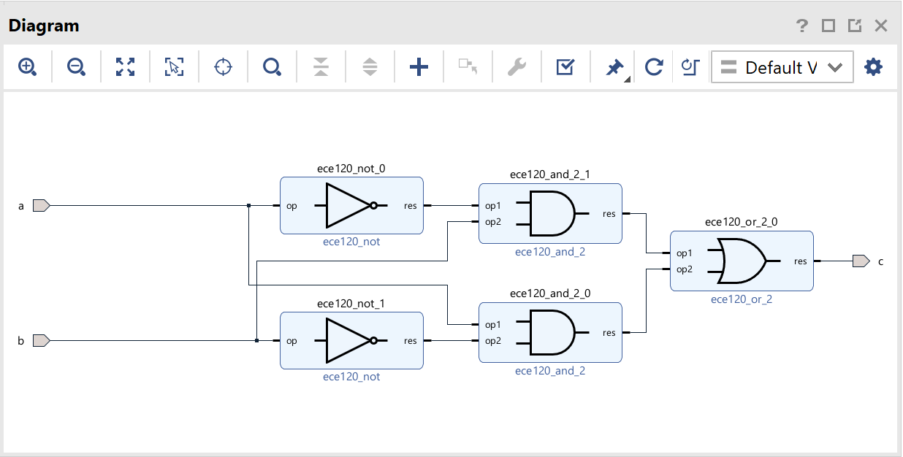

- Run the simulation again, and it should provide the expected result as follows:  

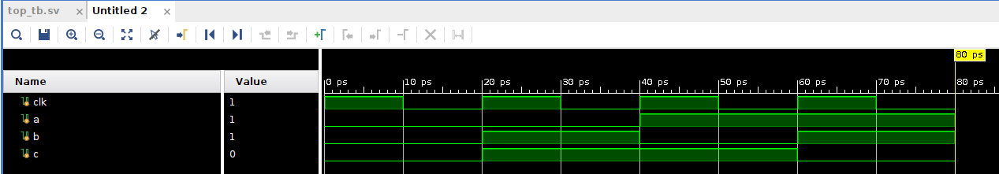

***Congrats! You have learned the basics of constructing a digital logic circuit in Vivado!***

## Submission
Now that you know how to use the tools, your assignment is to build a full adder circuit[^3] and verify its functionality. Create a new project, import ECE 120 IPs, and create a block design named `full_adder`. All the specifications for the full adder are given below. The rest is up to you. Good luck!

### Ports
| Port Name | Direction |
|-----------|-----------|
| a         | input     |
| b         | input     |
| Cin       | input     |
| Cout      | output    |
| s         | output    |

### Expected Result
| a | b | Cin | Cout | s |
|---|---|-----|------|---|
| 0 | 0 | 0   | 0    | 0 |
| 0 | 0 | 1   | 0    | 1 |
| 0 | 1 | 0   | 0    | 1 |
| 0 | 1 | 1   | 1    | 0 |
| 1 | 0 | 0   | 0    | 1 |
| 1 | 0 | 1   | 1    | 0 |
| 1 | 1 | 0   | 1    | 0 |
| 1 | 1 | 1   | 1    | 1 |

### Testbench
[fa_top_tb](./tb/fa_top_tb.sv)

### Turn-ins (Gradescope)
1. A single PDF of the block diagram **and** the simulated waveform


## Appendix
### What is Verification
When designing a digital circuit in a hardware description language (HDL), we are attempting to describe a hardware component whose behavior will comply with a high level description of an intended behavior (a specification). Hardware verification is a process which attempts to ensure that a design's behavior matches a specified behavior.

#### Verification is Hard
Digital hardware verification is a hard[^4] problem. For example, consider the collection of Boolean functions 𝐵ₙ = {𝑓 | 𝑓 : {0,1}ⁿ → {0,1}}.

These are the functions with 𝑛 binary inputs and a binary output.

How would you go about writing a program which takes as input an element of 𝐵ₙ (the specification), and a SystemVerilog description of a digital circuit (the design), and outputs whether or not the design matches the specification? Let's say we have a 2-input AND gate and we would like to verify its functionality. Simple, right? Iterate through all 4 possible input combinations and make sure we get the correct output for each set of inputs. Now let's say we instead have a 10-input AND gate. Suddenly, we have to iterate through 1024 (2<sup>10</sup>) possible input combinations which would take us *exponentially* more time. Can you come up with something significantly better than iterating through all 2ⁿ possible function inputs and ensuring that the output of the design matches the output of the specification?

#### Verification is Necessary
In lab 2, you may have experienced buggy software where developers put significant effort in debugging. This is also true for hardware development. But hardware verification is more challenging and expensive in industry.

There are numerous reasons, including the following from Kropf[^5]:

- Fabrication costs are much higher for hardware than for software.
- Hardware bug fixes after delivery to customers are almost impossible.
- Quality expectations are usually higher for hardware than for software.
- Time to market severely affects potential revenue.

In this excerpt, "quality expectations are usually higher" often means "human safety is at risk if this hardware device does not work properly".

#### Verification is Not Validation
A similar but different process to verification is validation. Whereas verification is a process by which we ensure that a design matches ***its*** specification, validation is a process by which we ensure that a design matches ***a*** specification.

Consider the case where a truck is designed to meet a specification of being able to haul twenty tons of material. The truck designers at ACME Truck Co. must verify that their trucks can haul twenty tons. Likewise, ACE Hauling Co. requires a truck which can haul twenty-two tons. Thus the engineers and technicians at ACE Hauling Co. must validate that the ACME Truck Co.'s truck can haul twenty-two tons.

#### How To Do Verifiction
There are three central tasks to verification:

1. Stimulate a design by providing sequences of stimuli.
2. Check that the design outputs results in accordance with the specification.
3. Measure how much of a design's execution state space has been stimulated and checked.


[^1]: Earlier version until `2019.1` should work as well but we will not provide support for it.
[^2]: Realistically the board doesn't matter as we will not be generating bitstreams but just for consistency sake
[^3]: Full adder is one component we can use to add unsigned binary numbers together.  In binary addition, we need to create both a sum output bit and a carry output bit.  To better understand the roles of these bits, think about regular decimal addition.  If we add 5+7, we would get a sum digit of 2 in the ones place and we would carry a 1 into the tens place to get the number 12.  Similarly, if we add 1+1 in binary, we would get a 0 in the ones place and we would carry a 1 to the twos place to get the number 10 (2 in decimal). The full adder adds three input bits together: a, b, and carry-in (Cin).  It also has two output bits: the sum (s) and the carry out (Cout).  If we arrange Cout and s as two bits of an unsigned binary number, then this binary number tells us how many 1s are in the inputs.  For example in the fourth row of the truth table, <a,b,Cin> = <0,1,1>, so <Cout,s> = <1,0> or 2 in decimal.  Similarly in the fifth row of the truth table, <a,b,Cin> = <1,0,0>, so <Cout,s> = <0,1> or 1 in decimal.

[^4]: co-NP-Complete
[^5]: Kropf, Introduction to Formal Hardware Verification, Springer, 1999, ISBN: 3-540-65445-3.