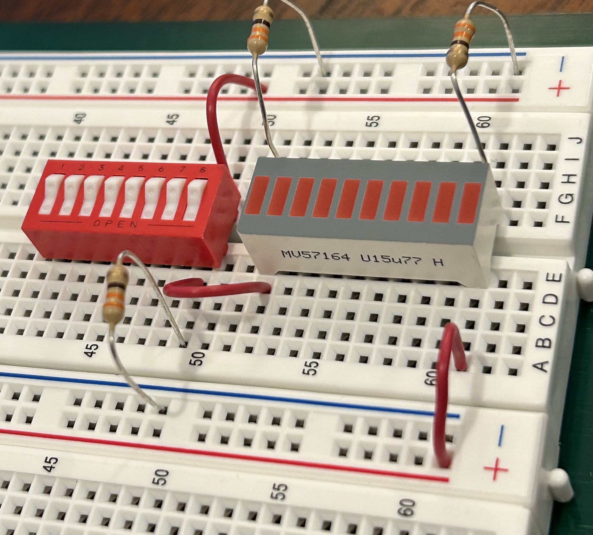

# Digital Logic Design with TTL microchips
## Overview

In this lab, we will explore how to prototype circuits with an electronic prototyping board ("protoboard"). Protoboards are useful for prototyping small circuits since they remove the need to solder or wire-wrap your connections which can make debugging and experimentation faster. By working with a protoboard, you will learn about some of the additional challenges of prototyping and creating physical circuits. You will also gain a deeper understanding for why we abstract voltages and currents as ones and zeros in digital circuits as well as why this abstraction sometimes fails. The lab will begin with an explanation of how the protoboard works, then we will discuss how to use the integrated circuit (IC) chips in your lab kit, and finally you will begin to design some simple digital logic circuits. In future labs, you will design a digital circuit that could control a vending machine.

## The Protoboard
The picture below shows a protoboard with a digital circuit assembled on it. There are a few key features that you should notice about the protoboard.


- The white portion of the board with hundreds of pinholes is referred to as the breadboard. You will build your circuits in this portion of the board.
    - There are two types of smaller breadboards: bus strips and terminal strips
    - Bus strips are the sections of the breadboard that have a red line with a '+' sign on one side and a blue line with a '-' sign on the other side.
    - Terminal strips are the sections of the breadboard that have letters across one side and numbers down the other.
    - Each bus strip and terminal strip is electrically insulated from every other bus strip and terminal strip.

- **Signals** identify a set of wires that are all connected electrically and contain the same information.
    - Each bus strip has two buses, the red bus and the blue bus, which are electrically insulated from each other.  All pinholes in each bus are electrically connected as a single bus and carry global signals: signals that should be made available to many parts of the circuit.  We typically connect the blue buses to the ground signal and red buses to the power signal so that power and ground are always close to where we need them.
    - On your breadboards, each terminal strip has 64 rows (labeled with numbers) and 10 columns (labeled with letters) and pinholes are grouped into sets of 5 pinholes called terminals.  Each row is electrically insulated from the others.  In each row, the A, B, C, D, and E columns are electrically connected to each other, but insulated from the F, G, H, I, and J columns by the center channel.  In each row, the F, G, H, I, and J columns are also electrically connected.  In other words, row 1 columns A, B, C, D, and E are a terminal and carry one signal; row 1 columns F, G, H, I and J are a different terminal and carry a different signal; and row 2 columns A, B, C, D, and E are yet another terminal and carry yet another different signal.  These terminal pinhole groupings are used to carry local signals: signals that may be connected to only a few other components.

## Tips for wiring

- Always disconnect your protoboard from power before changing any wiring on the protoboard. Otherwise, you may accidentally create a short that will draw more current from the power source than your circuit or the power source can handle.
- Try to reserve **red wires for power signals** and **black wires for ground signals**.
- Try to use the different colors of wire to group similar types of signals together.  
- Use shorter wires when possible to reduce visual clutter
- Some students like to label their wires with post-it tabs
- Keep all testing and debugging circuitry such as switches and LEDs in one part of the board.  Get this part of your circuit working correctly and then leave it alone!
- Orient all integrated circuit (IC) chips in the same direction.
- If something is not working correctly, your first debugging step is to make sure that all IC chips have power and ground. No power or ground to a chip is the most common mistake.

## Wiring your board for power and ground

Before you wire your board, let's take a moment to briefly discuss voltage, current, and basic circuitry to help you better understand how your circuit works.  In order for a circuit to conduct electricity, it must have an electric potential difference (or voltage) and have a closed loop for current to flow through. Your power supply creates a supply voltage of +5 volts as measured by comparing the difference in electric potential between **power** and **ground**. The power supply is half of your circuit's loop. You will add integrated circuit (IC) chips, resistors, and wires to your protoboard which will bridge this potential difference, close the loop of your circuit, and thus allow current to flow.

```
Important side note

Voltage is related to current by Ohms law which states that Voltage (V)
is equal to current (I) times Resistance (R) (that is, V = IR). Because
the resistance of a wire is almost 0, you should never connect power and
ground with just a wire since the current would increase to a point that
would either damage your protoboard or the power supply (I = V/0 leads to
infinite current).
```

Most of you have received the power circuit board (as shown below), it also provides 5V DC from either a power adapter connected to a 120V AC source, such as a wall outlet or through a 9V battery, using the included battery adapter wire. The following two diagrams are for the power circuit board, not for the ADALM2000:

- First attach the power circuit board as shown below across the supply lines. Make sure the "+" on the board lines up with the red power supply line and the "-" lines up with the blue power supply lines on both sides. Also, make sure the jumpers (the yellow pieces of plastic) are situated as shown in the picture below. They should be over the left two pins, where it says "5V" the board. This indicates the board will be supply 5V.


- Then, use red wires to connect all red power buses together (as shown in the picture below). This will be power (+5V).
- Use black wires to connect all blue ground buses together (also shown in the picture below). This will be ground (0V).


- At this point you may want to use a multimeter to check the voltage of your power and ground buses to confirm that there is approximately +5 volts of potential difference between power and ground. To check the voltage, you will need to compare the potential difference of two locations on the protoboard, so connect the black probe to a ground bus and the other probe to a power bus. If you get -5 volts, reverse the order of your probes. (Important note: many students cannot measure a circuit's voltage because they try to probe only one point in the circuit. Always remember that the voltage is a potential difference and a difference requires two points to compare.)

## Create your testing and debugging circuitry

In your lab kit, you will find a black foam pad with a number of integrated circuit (IC) logic chips embedded in it. This special foam is electrically conductive so as to dissipate any static charge, which can easily destroy ICs. On the foam pad, you will find a rectangular white "brick" with ten horizontal strips on the top, and two rows of ten electrical pins on the bottom. This is a ten-segment Light-Emitting Diode (LED) unit. You will also find a red brick with eight tiny white switches on it. We will use these two components to build your circuit tester and debugger. We recommend placing your debugging circuitry on the far-right side of your protoboard so that it does not get entangled with your other circuits and so that you can leave it in place when you prototype other circuits. We also recommend that you do not disassemble this circuit until the end of the semester.

Let's power up an LED following the schematic diagram shown below.


1. **Disconnect your protoboard from power.**
2. Carefully place the LED brick over an open center channel of a terminal strip (preferably near the corner of the protoboard). The distance between the pinholes on opposite sides of the channel exactly matches the distance between the pin layout on the bottom of the LED brick, so you will feel the brick slip into place when it is properly aligned. Once you are confident that your brick is properly aligned with the pinholes, apply even pressure across the top to force the pins of the chip down into the holes. Be careful; if you bend the pins, connections will not be made and the brick may become unusable.
3. Once your LED brick is inserted, you need to find the correct polarization. A light emitting diode is first and foremost a diode, which is a semiconductor device that allows current to flow almost freely in one direction (while emitting light if it is an LED), and almost completely blocks current flow in the opposite direction. You can easily determine the direction in which your LEDs are activated by finding out which direction causes them to light up; unlike the TTL chips you will use later, you will not harm LEDs by applying voltage in the wrong (current-blocking) direction. However, you can easily burn out an LED by applying too much current in the forward direction. Therefore, you should never connect an LED directly between power and ground; always place a few-hundred-ohm resistor between ground and the negative lead.
4. Take a 330-ohm resistor (one with two orange bands at one end) from the small resistor pack envelope in your kit and insert one lead of the resistor into the nearest ground bus.
5. The part number is written on the positive side of LED block, which should be connected to high voltage for a forward biased (lit up) LED. You want the resistor, which is connected to ground, to go on the negative side of the LED block. The negative side of the LED block is blank, so insert the other hanging lead of your resistor into the same terminal as one of the LED bars on the blank side of the block.
6. Connect the other end of your chosen LED to the nearest power bus with a wire. This should be the side with part number written on it (the positive side).
7. **Reconnect your protoboard to power**. The LED should light up! If it doesn't, check your wiring carefully and measure the voltages at both sides of the LED and resistor with your voltmeter to make sure that the one side has positive voltage and the other is grounded (through a resistor). If it still doesn't work, repeat with a different LED in the brick. If that still doesn't work, ask your lab instructor or TA for help. We recommend you leave one LED connected in this way to provide a constant visual indication as to whether your board is currently powered; a surprisingly high fraction of the time, the problem is that one forgets or fails to connect power and ground properly!
8. If you want, connect the negative lead of every LED to ground with a 330 ohm resistor so that they are ready to be used whenever you need them.

Next, we will add the switch and wire it up to supply 0V or 5V inputs into an LED. The schematic diagram of the circuit we are going to assemble is shown below, with parts shown in red to be added to the circuit you just have assembled.


1. Insert the switch brick near to the LED brick.
2. The switches connect directly across the short side of the brick as do the LEDs; an electrical connection is made when the switch is down, and the connection is open (or broken) when the switch is up. Using a 330-ohm resistor, connect ground to one side of one of the switches, and power to the other. Now, when the switch is open, the resistor-side will be connected only to ground. When the switch is closed, the resistor-side will be connected directly to power through the switch, and the voltage there will be 5 V. The resistor will limit the current flowing from power through to ground so as to avoid burning out the switch, the protoboard, or the power supply.
3. Connect your switch output directly to the positive side of another LED.
4. Connect the negative side of the LED to ground using a resistor.
5. Connect your circuit to power.
6. Flip the switch you just wired up and down to confirm that your switch now produces digital 1 (LED is on) and 0 (LED is off). These digital values will be used as inputs to your digital logic circuit. The LEDs can be used to test whether your circuit has the correct output.

You may want to wire more than one switch to supply multiple digital inputs. An example of debugging circuit with two switches wired is shown below.




## Create a digital logic circuit

In this section, we will show you how to create a digital logic circuit on the protoboard by using transistor-transistor logic (TTL) chips. Your lab kit has an abundance of NAND and NOR gates, but no AND and OR gates. Remember that it is easier to implement NAND with certain technologies such as CMOS and TTL. Let's begin with a brief tutorial on TTL chips.

- A TTL chip is also called a dual-inline package (DIP).
- Each DIP has a small notch which indicates the "top" of the DIP.
- All pins on a DIP are numbered so that we can match the physical DIP with the specification.
- The pin immediately to the left of the notch is called Pin 1.  The remaining pins are numbered with increasing numbers in a counter clockwise direction around the DIP.
- Each DIP has a +5V power pin and a ground pin.  These pins provide power and ground to each gate or component on the chip and are typically located in the corners of the DIP.


1. Disconnect the circuit from power.
2. Find a CD74AC00E (or 74LS00) chip in your chip kit. Look for the numbers printed on the top of the DIP. The CD74AC00E TTL chip has four (or "quad") two-input NAND gates each with two inputs and one output as shown in the specification below.


3. Find the "top" of the chip by finding the small groove on one side of the DIP
4. Insert the CD74AC00E DIP into a terminal strip near your debugging station and so that it bridges a center channel. We strongly recommend that you insert all of your chips so that the top notch is pointing towards the power and ground jacks. Consistency in your chip orientation will limit the possibility for errors and will ease debugging
5. Connect Pin 14 to a nearby power bus and connect pin 7 to a nearby ground bus. We recommend using the shortest wires possible, and using red for power and black for ground, to again help with debugging.
6. We can choose any of the four NAND gates on the DIP, but lets connect the NAND gate that uses pins 1, 2, and 3. When you build your own circuits, we strongly recommend that you draw a circuit diagram like the one below that tells you which DIP is being used for which gates and which pins you are using.


- Connect one input of a NAND gate (Pin 1) to a switch of your choice.
- Connect the other input of the same NAND gate (Pin 2) to a different switch.
- Connect the output of the NAND gate (Pin 3) to the positive lead of an LED.

7. Connect your circuit to power.
8. Flip the switches through all combinations of binary inputs to verify whether your circuit implements the NAND truth table below.


The pictures below show schematic diagram and an example of wired NAND gate using pins 1, 2, and 3.


# Lab 4 Assignment
## What to do

For the final portion of this lab, you will implement an XOR function using only NAND gates (since you are using TTL chips). You only need one CD74AC00E DIP to implement this XOR function. We provide a circuit layout **template (below)** for you to use which shows you how to build the XOR gate. We also provide the truth table for the XOR gate below. Fill out the empty boxes with pin numbers of your NAND gates. Also indicate your inputs (a, b) and output (F).

**DEMO** Sign up for a demo slot at the following ([Link](https://cally.com/pvx69i8kxymnkyv5)). This will be how you are evaluated for this assignment.


# Grading Rubric:
- 5 points for power circuit
- 5 points for LED portion of the debug circuit
    - -2 points if no resistors
    - -5 points if LEDs not in the required order ABF
- 5 points for switch portion of the debug circuit
- 10 points for XOR implementation
    - -2 points if the circuit does not correspond to circuit layout template pin labels (as shown above)

**Suggested Reading**
- [Transistor-transistor logicLinks to an external site.](http://en.wikipedia.org/wiki/Transistor%E2%80%93transistor_logic)
- [7400 series of TTL integrated circuitsLinks to an external site.](http://en.wikipedia.org/wiki/7400_series)
- [Digital Logic Pocket Data Book from TILinks to an external site.](https://www.ti.com/lit/ug/scyd013b/scyd013b.pdf)

```
What do I do if I think I have broken parts?

First, make sure it is really broken. Check your wiring for a short
circuit and check if your part is properly inserted and powered. We will
not be able to replace the kits and its component. You will need to
collect the components from the local market.
```
