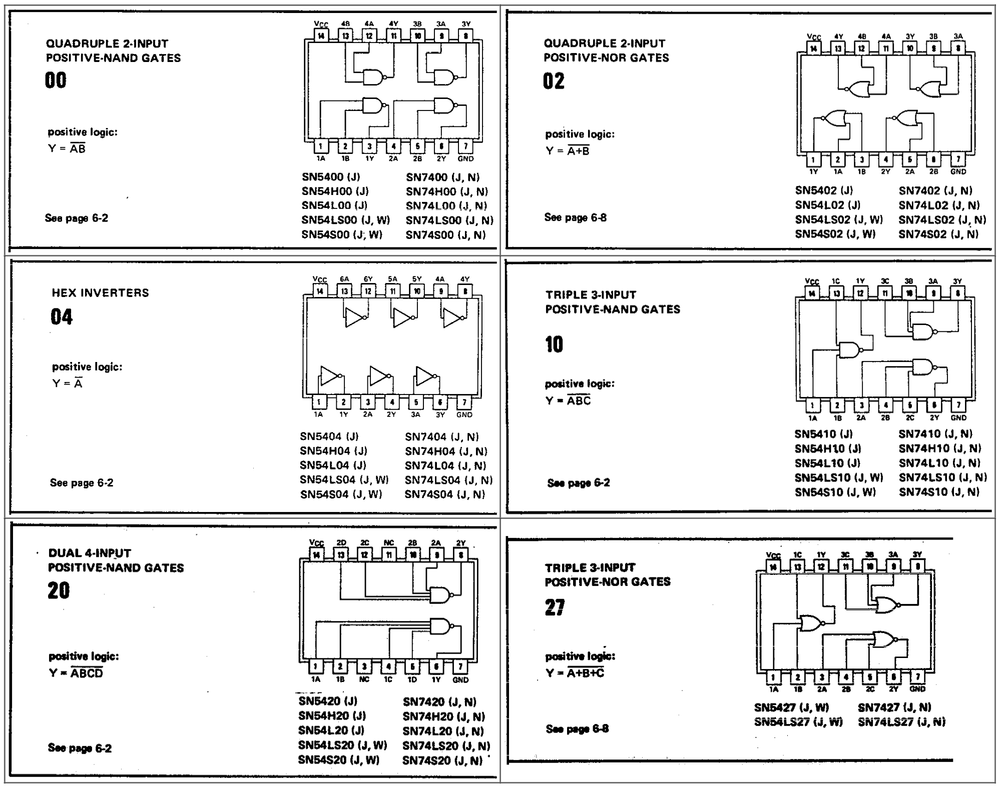

# Combinational logic implementation with TTL

In this lab, you will implement the circuit you designed last week in Lab 5 as a working prototype on your protoboard. The circuit must be implemented using NAND or NOR gates only, with as few inverters as possible. (Yes, you can use NOT gates as needed, but try to use as few as possible.) Your circuit must implement the specification given in Lab 5 and generate two output signals "Accept coin" (A) and "Paid in full (dispense Product)" (P).

- A = 1, when the coin that has just been inserted should be accepted. A = 0, when the coin that has just been inserted should be rejected.
- P = 1, when the product should be dispensed. P = 0, when the product should not be dispensed.

## Instructions

Use the provided [worksheet here](./lab_worksheet.pdf) to draw your truth table and the layout of your TTL DIPs before implementing them on the protoboard
- Your TTL DIPs, LEDs, and DIP switches should all be placed across a channel separating two blocks on the breadboard, just as you did in Lab 4
- Try to lay out your design for minimal clutter. This will not only help you debug if problems arise, but it will also make it easier to grade
- Label each TTL DIP with a letter (e.g., A, B)
- Label each used pin on your TTL DIPs with the pin number (1,2,...14). This will help when you go to wire the actual circuit.
- Only labeling is required, but showing some wiring may be useful for you when assembling the circuit. In fact, you do not need to show the entire wiring; just signal labeling may be sufficient.
- Label your NAND or NOR circuit diagram saved from Lab 5. Label each input and output with a DIP letter and pin number as a schematic for how you will connect the chips on your protoboard.
- The TTL chipset you received allows you to use only NOT, 2-input NAND, 2-input NOR, 3-input NAND, 3-input NOR, and 4-input NAND gates. Make sure you can implement your circuit with just those gates.
- Use the datasheets below to choose which TTL DIPs you will use and to determine how you will select which pins to use.
- Implement, test, and debug your circuit on the protoboard by using your TTL DIPs, switches, and LEDs.
- You will need to use at least 3 switches and 2 LEDs to demonstrate the functionality of your circuit. We recommend using more LEDs to help you debug.
- Make sure to connect each input switch to an LED to clearly display the active input combination. **This is required for full demo points.**
- During your testing and demonstration, bring your worksheet and use the switches to send all possible combinations of inputs into your circuit. Keep track of whether the LEDs show the behavior you specified with your Boolean expressions or truth tables.

## What to do at the demonstration

Do the following during your demo slot. 

- Show the TA your Xilinx Vivado circuit diagram (from Lab 5) labeled with pin and chip assignments. If you realize that your Lab 5 design is not practical to implement, you do not need to redraw it in Vivado, but you will need to tell the instructor what the difference is between your Vivado design and the protoboard implementation.
- **You must show the TA your [completed worksheet](./lab_worksheet.pdf).** Clearly indicate the switches and LEDs in your demo.
- Demonstrate your working circuit to the TA by showing that your circuit creates the correct outputs for all input combinations. For example:
    - Start with the switches in position S2S1S0 = 000.
    - Flip switches through the sequence S2S1S0 = 000 to 001 to 010 to 011 to 100 to 101 to 110 to 111.
    - Note: if you have done everything correctly, the demo should not take more than five minutes.                                                

**Do not disassemble the circuit as you will need it in Lab 8!**

## TTL DIP data

Use the datasheets below to find out which TTL DIP to use for the different types of gates (2-input NAND, 2-input NOR, 3-input NAND, etc.) and to determine the pin assignments for your schematic.  The title in the top left of each datasheet tells you what types of gates are in the DIP.  The schematic on the top right of each datasheet shows you how the inputs and outputs of the various gates are connected to the pins of the TTL DIP.  The text on the bottom right tells you which labels on your TTL DIPs to look for. The different serial numbers represent slightly different implementations of the same basic design. (Note: You may not find an exact match in the parts number list. But these chips share the same package as the ones listed. For example, CD74AC00E is the quad 2-input positive-NAND gates, and CD74AC04E is the hex inverters, etc. Please check out How to read data sheets for more information on reading datasheets for these chips.)  Notice that there are many ways to implement even simple 2-input NAND gates. We have provided you with some extra chips in your kits. If you burn out a chip, check if you can still complete the design without purchasing replacements.

**Please sign up for a demo (2/29/2024 - 3/5/2024) timeslot at [this link](https://cally.com/event/subscribe/pkxqc7t66yfnkdpq).**

# Grading Rubric

- 5 pts for NAND (or NOR) **circuit diagram AND [lab worksheet](./lab_worksheet.pdf)** labeled with pin and chip assignments.
    - ideally, both Lab 5 diagram and Lab 6 worksheet should be presented, but it is OK if you label just one of them with the pin assignments.
    - Failure to present either of these **will** result in points being deducted from your demo score.
- 30 pts for a working circuit
    - students must show written down truth table and demonstrate a working circuit by going over the entire truth table
    - for don't care states, either output is OK
    - 5 pts for each row without don’t cares
    - -2 pts if no resistors on LEDs
    - -2 pts if more than 3 chips are used
    - -5 pts if the circuit does not correspond to the printed diagram or pin/chip assignments on the diagram
