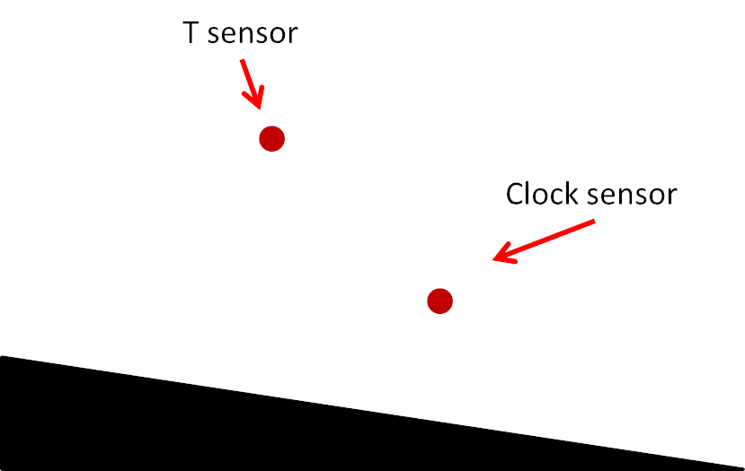
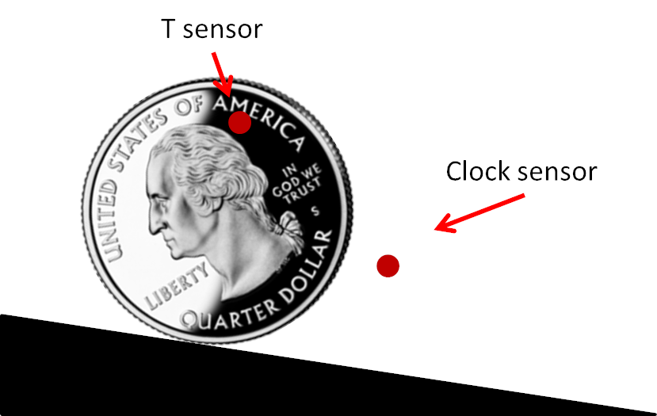
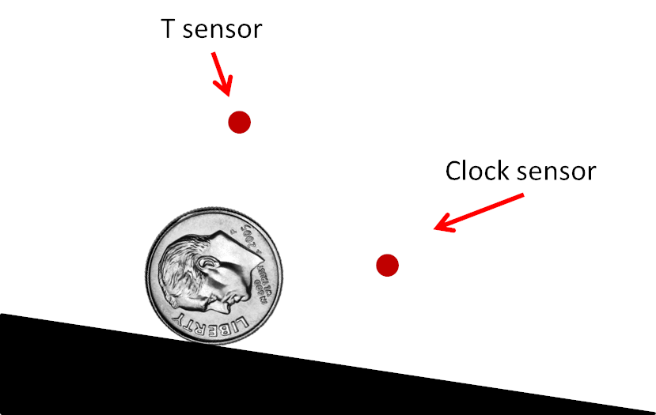
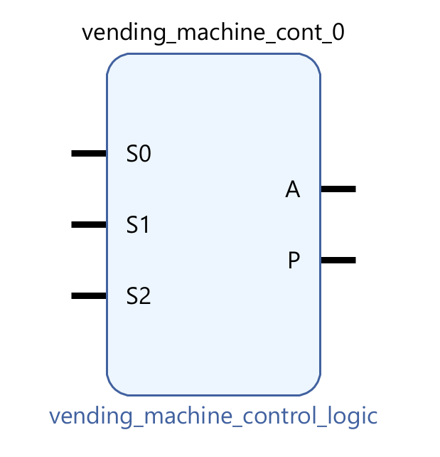
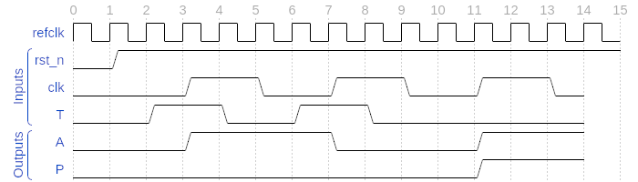

# Sequential Logic Design
## Overview
- Recall that you designed and verified the control logic part of the vending machine controller
    * That is, the combinational aspect which determines **A**ccept and/or Dis**p**ense based on the state
- In this lab, you will implement the next state logic of the controller
- Your responsibility is to determine the correct next state for each state 
- Your vivado project name and block design name **must** be named `vending_machine`, failure to do so will result in a 0
- You may **only** use a combination of NAND, NOR, NOT gates. The usage of other gates will result in an immediate 0

## Specification
Recall the state definition as follows: 
| S2 | S1 | S0 | Definition |
|----|----|----|------------|
| 0  | 0  | 0  | No money was previously inserted. No money has just been inserted | 
| 0  | 0  | 1  | A quarter was previously inserted. A quarter has just been inserted | 
| 0  | 1  | 0  | A dime was previously inserted. A quarter has just been inserted | 
| 0  | 1  | 1  | No money was previously inserted. A quarter has just been inserted |
| 1  | 0  | 0  | Unused | 
| 1  | 0  | 1  | A quarter was previously inserted. A dime has just been inserted | 
| 1  | 1  | 0  | A dime was previously inserted. A dime has just been inserted | 
| 1  | 1  | 1  | No money was previously inserted. A dime has just been inserted |

As this is sequential logic, you will use the flip-flop module `ece120_dff` we have provided:
| Port Name | Direction | Definition |
|-----------|-----------|------------|
| clk       | input     | clock      |
| rst_n     | input     | active-low asynchronous reset |
| D         | input     | data in    |
| Q         | output    | data_out   |
| Q_n       | output    | inverted data_out |

Notice that the reset pin on the flipflop is **active-low** and **asynchronous**. Since the reset is asynchronous, the flipflop resets independent of the clock. Therefore, we say that this flipflop resets to 0 upon the **falling edge** of `rst_n` (as opposed to the rising edge since the reset is active-low).

You will combine the design with lab 5 for a complete controller, the top level port is as follows:
| Port Name | Direction |
|-----------|-----------|
| rst_n     | input     |
| clk       | input     |
| T         | input     |
| A         | output    |
| P         | output    |

## Physical Sensor Design
- In order to simulate your state machine, you need to better understand how the physical system of the vending machine works, so you can abstract its functionality
- The vending machine accepts coins by letting them roll down a ramp with sensors
- Each sensor sends a 0 when no coin is in front of the sensor
- Notice the T sensor and clock sensor are at different height



- When a quarter is inserted, it will first block the T sensor, sending a 1
- It will then block the clock sensor, creating a positive edge



- When a dime is inserted, it will not block the T sensor due to its smaller size
- It will still block the clock sensor



- You should then use `T` as the input for the state transitions.
- T=1 when a quarter has been inserted and T=0 when a dime has been inserted.
- This state machine is also driven by a clock that indicates when a coin has been inserted.

## Abstraction
Once you come up with next-state expressions for `S2`, `S1`, and `S0`, the next step would be to combine the next-state circuit with the output generation circuit that we built in lab 5. Since lab 5 should be complete and working by now, we can simply treat it as a black box with inputs `S2`, `S1`, and `S0` and outputs `A` and `P`. To do this concretely, we will package lab 5 into an IP and import it into our lab 7 block diagram. This step is known as abstraction.

In order to achieve this, follow these steps:
- Open your lab 5 project
- Click on `Tools` -> `Create and Package New IP...` -> `Next`
- Select `Package a block design from the current project` under `Packaging Options` and hit `Next`
- It does not matter where you set the IP location but you have to remember it. Here is an example path: `/home/YOUR_NETID_HERE/hardware_labs/lab5_ip`
- Keep clicking on `OK` and finally `Finish`
- A window called `Package IP - design_1` should show up. We will keep most of the default settings but let's change the name of our IP so we can easily identify it.
    - Under `Identification`, change `Name`, `Display name`, and `Description` to `vending_machine_control_logic`
- You will also need to archive the IP for grading purposes
    - Under `Review and Package -> After Packaging -> Edit packaging settings -> Automatic Behavior -> After Packaging -> Create archive of IP`
    - Make sure the check box is ticked
    - This will generate a `.zip` file at the IP location, make sure you save it and rename it `lab5.zip` for turn in
- Now simply click on `Package IP` under `Review and Package`.

Congratulations! You have abstracted lab 5 into an IP ready to be used in lab 7. Now, we can finally begin working on building the next-state logic and combining it with our IP:
- Create a new project for this lab and import the ECE 120 IPs, just like you did in labs 3 and 5.
- (note: Your vivado project name and block design name **must** be named `vending_machine`, failure to do so will result in a 0)
- Now go to `Tools` -> `Settings...` -> `Repository` under `IP`
- Click the `+` button and look for your IP. Vivado should detect that 1 IP has been added.
- Hit `OK` -> `Apply` -> `OK` and create a new block diagram named `vending_machine`
- Now try to add your IP just as you would for a gate. If you were successful, you should see the following component show up:



## Example Waveform



- Remember to reset the controller to the initial state
- A quarter was inserted at time=3
    * `clk` raised at time=4
    * Coin is accepted
    * Product is not dispensed
- Another quarter was inserted at time=7
    * `clk` raised at time=8
    * Coin is not accepted
    * Product is not dispensed
- A dime was inserted at time=11
    * `clk` raised at time=12
    * Coin is accepted
    * Product is dispensed

## Verification
- We have provided an empty testbench for you
- You will simulate the insertion of the coins using the tasks we have provided
- You will then verify the output using `assertAP`
- Here is an example for the waveform above:
```
initial begin
    init();
    reset();
    /*** Insert your coin below ***/

    quarter();
    assertAP(1, 0);
    quarter();
    assertAP(0, 0);
    dime();
    assertAP(1, 1);

    /******************************/
    $finish;
end
```

- You have freedom in how you verify your design. However, we highly recommend you test all the state/transitions

## Turn-ins (GitHub)
1. Exported `lab7.tcl`, refer to lab5 if you don't remember how to export
2. Archived `lab5.zip` IP

Both of these must reside in your `lab7` folder
