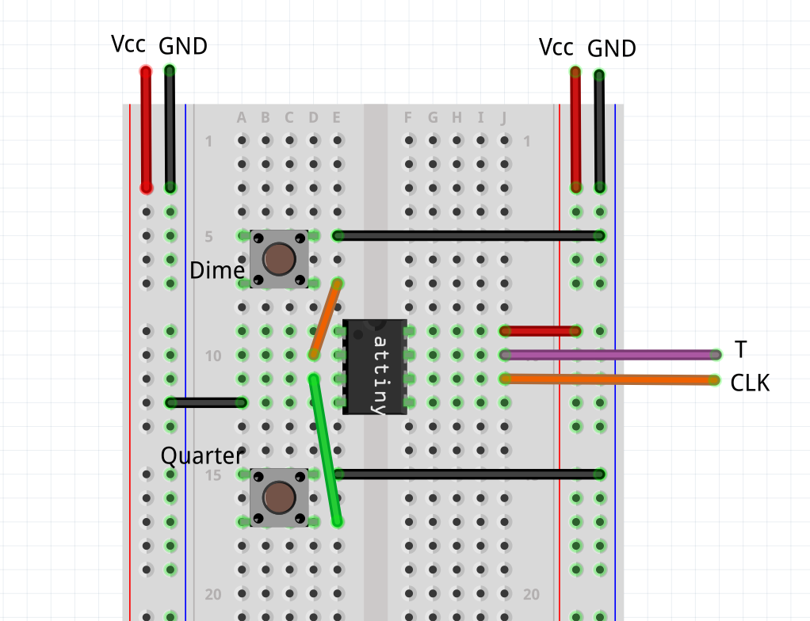

# Sequential logic implementation

## Overview

In this lab, you will implement on your protoboard the vending machine example from Section 3.3, “Design of the Finite State Machine for the Lab.” In Lab 6, you implemented a combinational logic circuit that produced two output signals A (for "accept coin") and P (for "dispense product") based on the state S2S1S0. In Lab 7, you designed and simulated the finite state machine using Xilinx Vivado. In this lab, you will complete the protoboard implementation of the state machine. You will test it with the sensor/actuator device described below. **[Extra credit](#grading-rubric-45-pts) is available!**

## Implementing the State Machine on the Protoboard

- For flip-flops, we recommend that you use either the 7474 DIP or the 74175 DIP. 
- The top data sheet shows the pin layout for the 7474 DIP which has two distinct positive-edge-triggered D flip-flops. Note the behaviors of the PRESET and CLEAR.
- The lower data sheet shows the pin layout for the 74175 DIP which has four positive-edge-triggered D flip-flops which share common CLEAR and CLOCK signals. **When the CLEAR signal is 0, it asynchronously resets all of the flip-flops to store 0.** 

- Implement your state machine and connect it to your Lab 6 circuit that generates your outputs A and P. **Don't forget to first detach your switch inputs to your Lab 6 circuit in order to avoid driving them against the state outputs and possibly burning out your flip-flops.**
- Connect your current state variables S2, S1, and S0, and outputs A and P to LEDs so that you (and the TAs) can easily check to see whether your circuit implements the correct state transitions and outputs.

**Background**: You are going to use a preprogrammed IC (Atmel, Attiny 13) and two push button switches to simulate the T and CLK signals of the vending machine. However, note that we suggest you test your Lab 8 using the physical prototype vending machine during regular office hours in room ECEB 4022, but know that using the physical prototype is optional for the demo. Refer to the following [guide](./prototype_guide.md). **While you are not required to use the physical vending machine, we suggest that you still read the guide and watch the included video to understand how the vending machine system works as a whole.** 

## Pre-Programmed IC Implementation

To simulate the T and CLK signals, you will be using two push button switches along with a pre-programmed chip (Attiny 13, as shown below on the left). When the switch labeled as dime (as shown below on the right) is pressed, the desired T = 0 and CLK signals (as described above) are generated. Similarly, when the Quarter switch is pressed, T=1 and CLK signals are generated.

The final implementation of the circuit is shown below. For more information, please see the video ([Lab#8 video](https://mediaspace.illinois.edu/media/1_s1wo6266))

## Reset Button Implementation

- We will implement the reset functionality with the use of a button.
- If you broke/lost a button, follow this [guide](./switch_guide.md) to set up the reset functionality using a switch instead.
- The figures below show the schematic and an example breadboard layout for the reset button. CLR refers to the CLR pin of the flip-flop IC.

## Some Useful Tips ...

- The circuit will be complicated. Making a rough sketch of your connections will speed up your debugging time. 
- Try to keep the layout clean and neat so that you do not have a "short" between 2 wires.  
- LEDs will be your best friend when debugging. Use them wisely!
- Test in phases! Make sure your FSM implementation is correct before you move on to testing the machine.

## Testing

Connect all the signals (CLK, T, S2, S1, S0, A, P) to the LED block so that you can see their values. Go through the state transition diagram in the following order and observe if the states (S2S1S0) and outputs (AP) match the expected values.

- Initialize the system to the `START` state by pressing the reset button.

- Now use the input sequence 1110100100011R0 (note that pressing the Dime switch makes T=0 and pressing the Quarter switch makes T=1, R refers to reset) for testing. The table below shows the expected behavior each time a switch is pressed in the prescribed order (you should be able to figure out the expected behavior based on the state transition diagram).

| Input (T)   | Expected State (S2S1S0) | Expected Output(AP) |
|:-----------:|:-----------------------:|:-------------------:|
| RESET       | 000                     | 00                  |
| Quarter(1)  | 011                     | 10                  |
| Quarter(1)  | 001                     | 00                  |
| Quarter(1)  | 001                     | 00                  |
| Dime(0)     | 101                     | 11                  |
| Quarter(1)  | 011                     | 10                  |
| Dime(0)     | 101                     | 11                  |
| Dime(0)     | 111                     | 10                  |
| Quarter(1)  | 010                     | 11                  |
| Dime(0)     | 111                     | 10                  |
| Dime(0)     | 110                     | 00                  |
| Dime(0)     | 110                     | 00                  |
| Quarter(1)  | 010                     | 11                  |
| Quarter(1)  | 011                     | 10                  |
| RESET       | 000                     | 00                  |
| Dime(0)     | 111                     | 10                  |

Once you are confident that your circuit works properly, bring it to the TA during your demo slot or one of the walk-in time slots, so that the TA/UA can check your circuit. The TA/UA should confirm your wiring before you power up your circuit.

Do the following during your demo slot:

- Show the TA your Lab 7 design with NAND, NOR and/or NOT gates and D flip-flops labeled with pin and chip assignments. You must bring the overall design, next-state logic and output logic.
- Show the TA your [protoboard layout sheet](./lab_worksheet.pdf). Download protoboard layout sheet (same sheet as in Lab 6).
- Follow the instructions for testing above and show the TA for confirmation that your circuit works as expected.

**Please sign up for a demo slot (3/21 - 3/27) using [this link](https://cally.com/pqxpwiznp7snu67v).**

## Grading Rubric (45 pts):
- 5 pts for NAND (or NOR) next-state circuit diagram labeled with pin and chip assignments.
- 5 pts for the protoboard layout worksheet with the entire circuit layout 
- 5 pts for correct A and P, either of them not working, minus 3 pts. Both not working, minus 5 pts.
- 30 pts for correct state transitions
    - If the circuit does not work as expected, you can fix it and demo it again.
    - If it still does not work after a few attempts to fix it, minus 5 pts per wrong next state transition (up to 30 pts)
- **+1% of the total Lab grade (capped at 15% of your overall grade) if you demo on Thursday or Friday.** Make an appointment for one of these days if you want the extra credit. You could still demo on these days even if you were not able to find an appointment, but your demo will not be prioritized by staff.

**IMPORTANT: Connect input buttons and all D flip-flop outputs directly to LEDs (in addition to A & P outputs) to receive full demo points. Minus 1 pt for each LED not connected (up to 5 pts).**

**Helpful tips for a hassle-free demo:**
- Align LEDs in order (S2S1S0-AP or AP-S2S1S0) and label the LEDs.
- Label the buttons.
- Follow the sequence RQQQDQDDQDDDQQRD.
