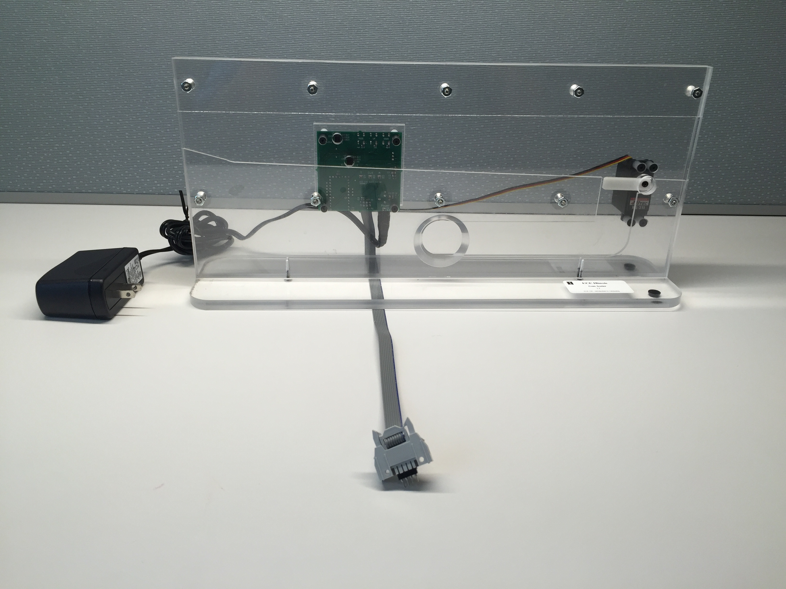
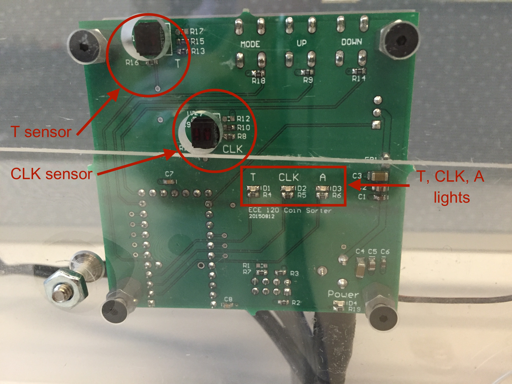
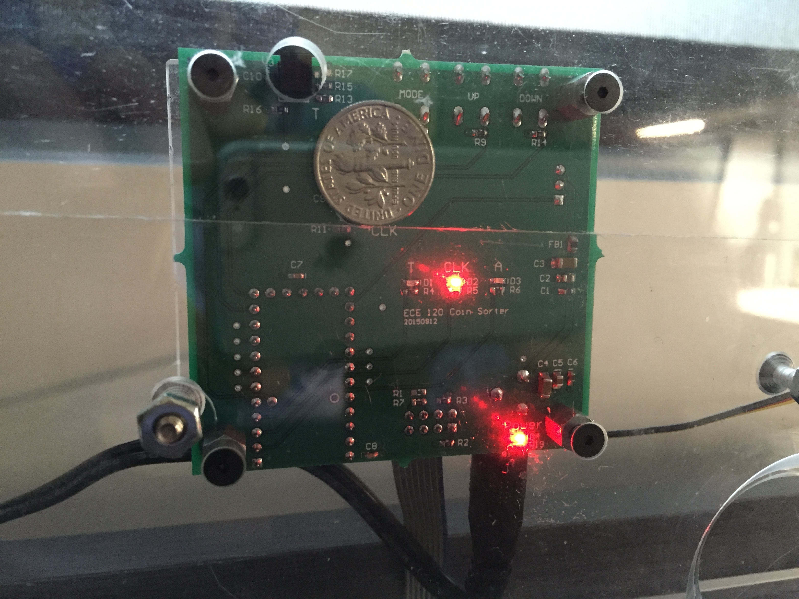
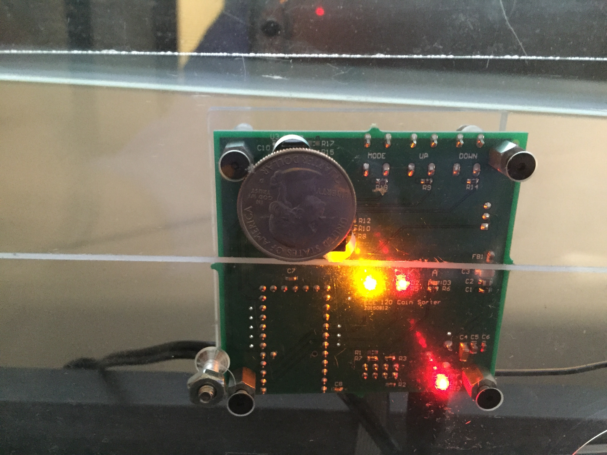
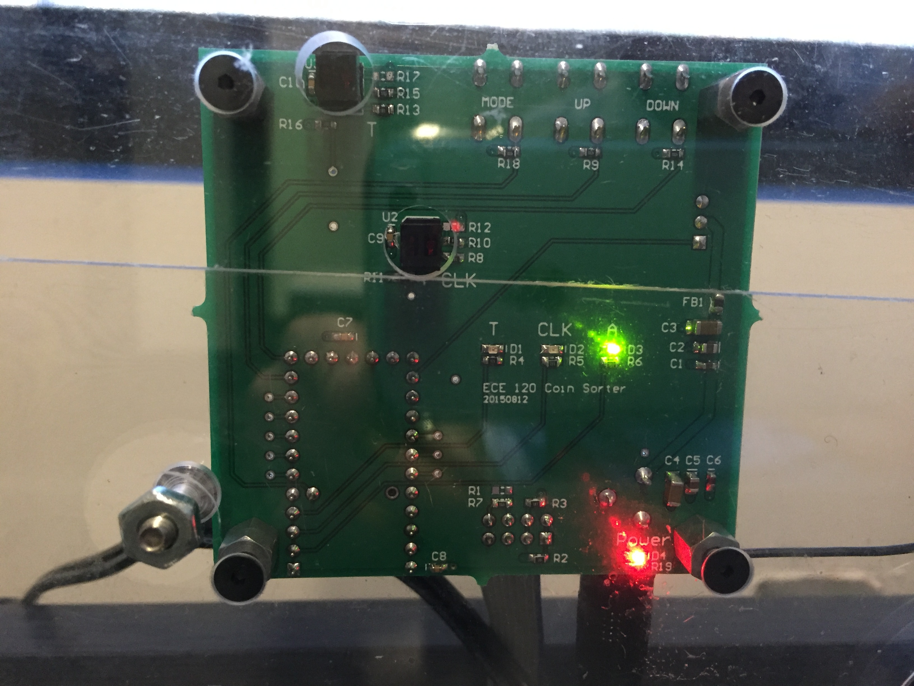
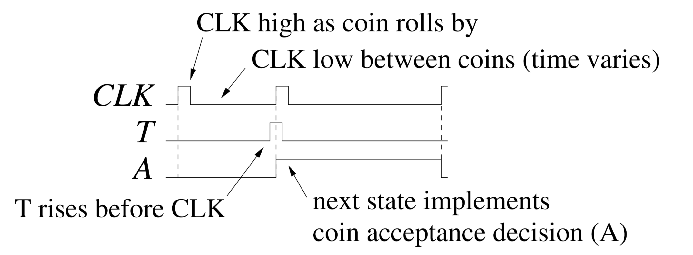
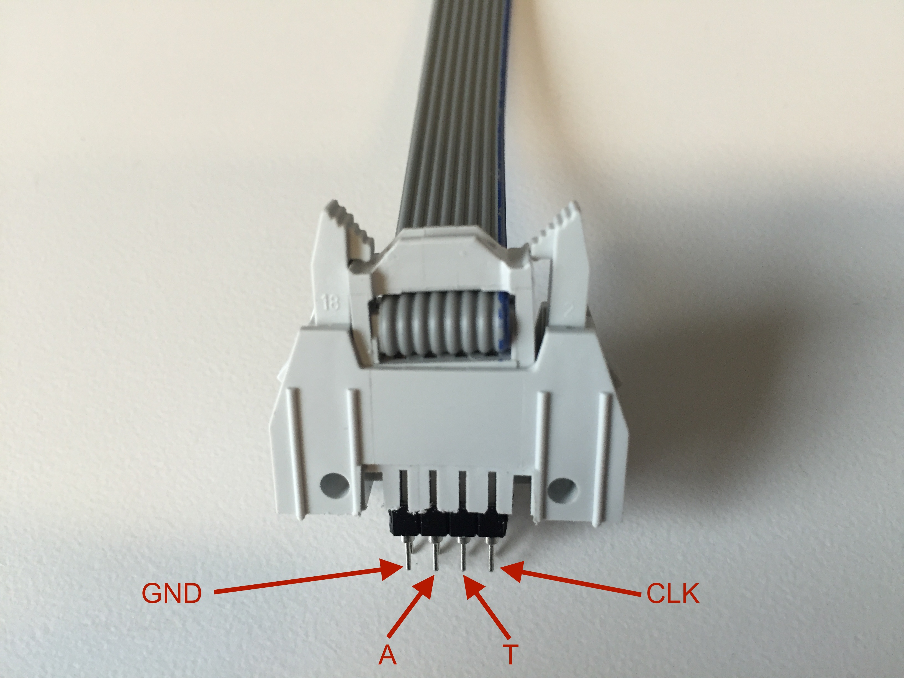
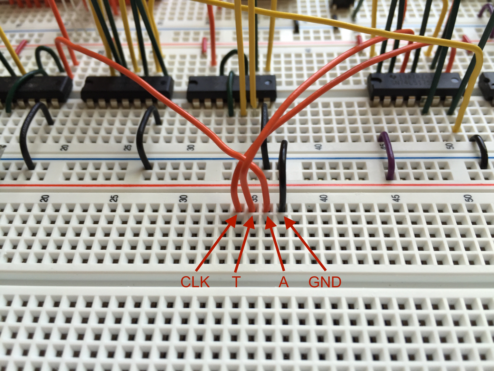

# The Interface to the Physical Vending Machine:

Refer to [this video](https://www.youtube.com/watch?v=Zk1RaK2S8PM&ab_channel=LabsECxplainEd) to learn more about this lab and the physical prototype vending machine - courtesy of the ECE Student Advancement Committee.

It has two optical sensors (T, CLK) and three LEDs (T, CLK, A) for visual feedback:

When a quarter is passing, the T and CLK LEDs will light to indicate that the T and CLK sensors have both detected a coin:

Similarly, when your circuit generates output A=1, the A LED will light to indicate that the signal has been correctly received:

The interface to the protoboard is given by a connector (a ribbon cable):

The connector has a total of 8 pins, but for simplicity in this lab,  we are only using 4 signals: GND, A, T and CLK. On the protoboard, you will have to wire the required signals in preparation for the connection. Make sure to leave enough space on your protoboard for the interface to the vending machine:

