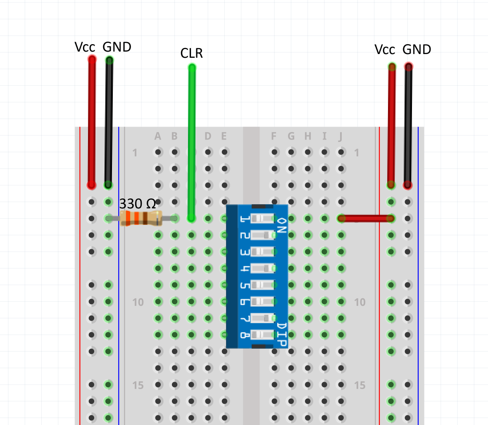

# Reset Switch Implementation

If you broke/lost a button, follow this guide to implement the reset functionality using a switch.
- The figure below shows the breadboard layout for the reset switch. CLR refers to the CLR pin of the flip-flop IC.

- You may have noticed that this is exactly the same as the input implementation in labs 3 and 5. That's because it is. Just make sure to keep the switch **closed** as you insert dimes and quarters.
- In order to reset, simply flick the switch **open** then flick it again to **close** it.
- You must make sure that the switch is closed before you operate the vending machine. Otherwise, it will be stuck in the `START` state.