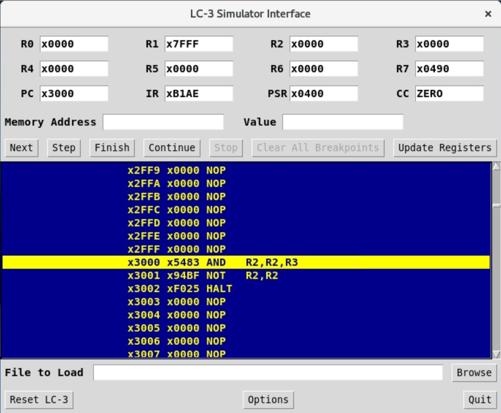
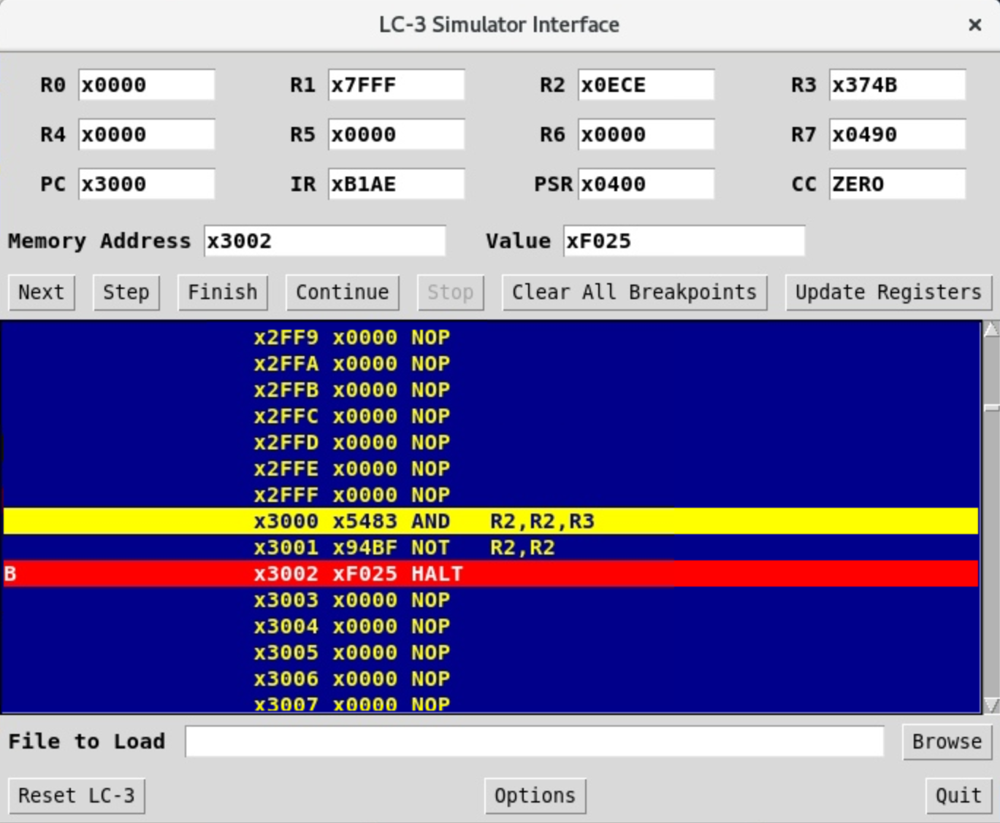

# Introduction to LC-3
## Overview
In this lab, you will learn how to write an LC-3 program in machine language and run it in the LC-3 simulator. You will run an extremely simple program which has been provided for you to guide you through how LC-3 works.

## Getting Started
Here is an example of [a very simple program](./example.bin) in LC-3:

```
0011 0000 0000 0000     ; ORIG x3000
0101 010 010 000 011    ; R2 <- R2 AND R3
1001 010 010 1 11111    ; R2 <- NOT R2
1111 0000 0010 0101     ; HALT
```

A couple of things to note:
1. Comment using `;`, the assembler ignores these; they are only used for human understanding
2. The first line of an assembly program contains the starting address of the program
    * This is **not** an instruction itself, but a directive[^1]
    * Therefore, this directive does not take up an address
    * Each subsequent instruction takes up the immediate next available address
        - `AND` @ `x3000`, `NOT` @ `x3001`, etc.
3. The `AND` and `NOT` instruction are much self explanatory
    * Refer to [appendix A of the LC-3 ISA](https://www.jmeiners.com/lc3-vm/supplies/lc3-isa.pdf) for list of opcodes
    * Notice the RTL syntax of `[dst] <- operation([source(s)])`
4. The `HALT` instruction is special
    * If you check page 541 of Appendix A, you'll see that it is a TRAP instruction
    * TRAP allows the program to make system calls[^2] via vectors, HALT has the 0x25 vector
    * You must use this instruction to terminate your program
5. This program is effectively doing `R2 <- R2 NAND R3`
    * ***IMPORTANT NOTE: You cannot assume the registers start with 0 intially, despite what the simulator says***
    * We are assuming some values have been placed in R2 and R3 here

## LC-3 Toolchain
**WARNING:** There are plenty of LC3 toolchains available online for you to download, but do so knowing that they may not be the same as the one on EWS, which we will use for grading. So you should always test your code on EWS.

Regardless of what programming language, all require a toolchain. From very simple ones like the Python Interpreter to messy ones like the C toolchain. The toolchain allows developers to compile (gcc), assemble (as), and sometimes debug (objdump) their code.

### Different software representations of the LC-3 ISA
- BIN
    * Binary/hexadecimal
    * Same as what's shown above
    * Hard for humans to understand
- ASM
    * Assembly
    * Similar to the RTL comment above
    * Easier for human to understand (still not as readable as languages like C and Python)
- OBJ
    * Object
    * Raw machine code
    * Borderline impossible for human to understand

### FAQ
- How does the toolchain flow differ between C and LC-3?
    * It's fairly similar since both are statically compiled languages
    * C: `C Code`->`Assembly`->`Object`->`Executable`
    * LC-3: `Assmebly/Binary`->`Object`
        - There is no linkage[^3] so the object is the executable

- How is assembly different from languages like C and Python?
    1. Assembly is specific to the ISA
        * ISA means "Instructional Set Architecture", centered around instructions
    2. High-level languages like C and Python are ISA agnostic
        * Most code can be cross compiled across different ISA with no issue
        * Some impossible for Assembly to do without a reinterpreter

### The Tools
#### lc3convert
This converts BIN files into OBJ files, syntax is as follows:
```
$ lc3convert [-b2] <BIN filename>
or
$ lc3convert -b16 <HEX filename>
```

#### lc3as
This converts ASM files into OBJ files, syntax is as follows:
```
$ lc3as <ASM filename>
```

#### lc3sim or lc3sim-tk
This is the simulator for lc3, allows the user to debug with various important functions like stepping and breakpoint.

The syntax is as follows:
```
$ lc3sim <OBJ filename>
or
$ lc3sim-tk <OBJ filename>
```
If you use `lc3sim`, you can type in `help` for a list of commands.

### Load the module
Before you can use the LC-3 toolchain, you must load it first:
```
$ module load lc3tools
```
Loading a module on EWS effectively exposes the application's environment for the user (You may also want to add this to your bashrc so you don't have to run this everytime).

## LC-3 Simulator
**NOTE: We highly recommend that you follow the below tutorial to learn how to debug. Debugging is one of the fundamental skills as an engineer; if you do not learn how to debug, you will not only struggle with the rest of ECE 120, but also with the rest of your ECE career!!**

- After you have loaded the LC-3 toolchain, run `lc3convert example.bin` to generate `example.obj`
- Run the simulator on `example.obj` with `lc3sim-tk example.obj`. Two windows must have showed up: `LC-3 Simulator Interface` and `LC-3 Console`.
- Ignore the warning message which says no symbols are available
- Ignore the `LC-3 Console` window for the time being. It will only be useful later, in labs 12 and 13.
- Your screen must look as follows: 



- Let's verify the functionality of the program by forcing R2 and R3 to some values. Click on the `x0000` next to R2 and change it to `x0ECE` then make sure to hit enter, otherwise, the values won't save
- Do the same with R3 and set it to `x374B`
- Click on `Update Registers`. Our program is now ready for testing!
### Continue

- In order to quickly test whether your program produces the correct output, simply click on `Continue`.
- Do not worry about the program jumping to `0x0494`. This happens due to the execution of `HALT`
- Look at the value in R2. Based on the expected functionality of the program described [here](#getting-started), is that what you expected?

### Step

- The downside of hitting `Continue` immediately is that you will only be able to know whether your whole program works as expected, with no information on what caused a failure
- Click on `Reset LC-3` and prepare the program for testing as we have done previously
- Click on `Step` in order to execute exactly 1 instruction. Did the `AND` instruction work as expected?
- Click on `Step` again and verify the functionality of the `NOT` instruction

### Break

- The downside of stepping through a program is that it is slow
- Reset the LC-3 and prepare the program for testing again
- Set a breakpoint at x3002, the `HALT` instruction, by double clicking on it. Your screen must look as follows: 



- Click on `Continue`. Notice how, this time, we stopped at the `HALT` instruction without executing it.
- Breakpoints are helpful for testing chunks of instructions at once. It will be extremely useful in labs 12 and 13 when your program will be executing hundreds of instructions!

***Congratulations!*** You learned how to debug an LC-3 program. The process of debugging a sequential program always follows the same set of steps: You make an educated guess as to where a bug might be based on the output, **break** somewhere around the suspicious chunk of code, **step** through the code, and make sure everything behaves as expected.

## Turn-ins (Github)
You will write a program that puts the decimal number 42 in register R2. You are allowed to use all of the registers but the program must perform its expected functionality **regardless** of the initial register values. Remember to use the LC-3 simulator to verify the functionality of your program!

[Starting code](./lab9.bin) has been provided to you. 
Please do not change the filename or the ORIG location.


[^1]: Directive tells the assembler how to assemble the program, recall program have to be compiled/assembled into machine code for execution

[^2]: System calls allows the program to execute operations that require higher privileges, i.e. `HALT` (stop the program), `OUT` (prints a character to terminal), `IN` (gets a character from terminal). Read Table A.2 on page 543 for a list of service routines. 

[^3]: Linkage allows one source code file to call functions from another source code file. Remember `stdio` and `printf`? By including `stdio`, you are linking the function in that library to be able to be called from your own code. Unfortunately LC-3 does not have this feature.